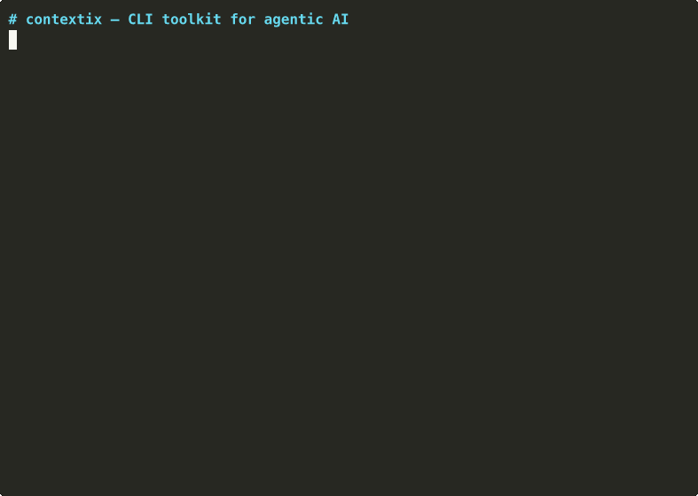

# Contextix

**A CLI toolkit for agentic AI.** Turn any **MCP server** — or RSS, markdown, URLs — into a typed knowledge graph. Query it from your terminal, your agent, or over MCP.



```bash
# Any MCP server → graph. One command.
npx contextix ingest mcp ./hackernews-top.mjs

# Or plain sources
npx contextix ingest markdown ~/notes
npx contextix ingest rss https://www.coindesk.com/arc/outboundfeeds/rss/

# Query the graph
npx contextix why "AI export controls"
npx contextix connect "Federal Reserve" "Bitcoin"
```

No Python. No Docker. No Neo4j. One `npx` command, your data stays local at `~/.contextix/graph.json`.

---

## Why

Your agent is smart about code, dumb about the world. Document RAG gives it text; vector search gives it snippets. Neither tells it **what happened, who's involved, and how it's connected**.

Contextix builds a **typed causal graph** from sources you choose. Agents query it via CLI — the same way they already call `git`, `rg`, or `curl` — so it slots into Claude Code, Cursor, Codex, Aider, or any shell-capable agent. MCP mode is bundled for Claude Desktop and MCP-native clients.

The wedge: the MCP ecosystem has 10,000+ servers exposing structured data — CoinGecko, arXiv, HackerNews, GitHub, Notion, Linear, your own — and zero graph layer on top. Contextix is that layer.

---

## Install

```bash
npm install -g contextix
contextix --help

# or one-shot
npx contextix ingest markdown ~/notes
```

Requires Node 20+. Optional: `ANTHROPIC_API_KEY` env var for agentic extraction (falls back to regex mode).

---

## CLI

### Ingest — point at sources

```bash
contextix ingest mcp <skill-file>       # Any MCP server via a skill file (JS/TS)
contextix ingest rss <url>              # RSS / Atom / RDF feed
contextix ingest markdown <dir>         # Markdown vault (frontmatter + [[wikilinks]])
contextix ingest url <url>              # Single page, OG/Twitter meta + body
contextix ingest json <file|dir>        # Pre-formatted graph fragment
```

Each ingest run:
1. Fetches / reads source (or runs a skill against an MCP server)
2. Runs extraction — **agentic** (Haiku 4.5 with tool-use) when `ANTHROPIC_API_KEY` is set, **regex** otherwise. MCP skills bypass the extractor since they produce structured output directly.
3. Dedups entities (`BTC` / `Bitcoin` / `bitcoin` → one canonical node)
4. Merges into `~/.contextix/graph.json` with `valid_from` timestamps

Force a specific mode with `--extractor agentic|regex|auto` or env `CONTEXTIX_EXTRACTOR`.

### MCP ingest specifics

A **skill** is a single `.mjs` or `.js` file that tells contextix how to talk to one MCP server and what to extract. Skills live anywhere — drop one next to your project, commit to a repo, or put it in `~/.contextix/skills/`.

```bash
# Keyless: Hacker News top stories → 20 events + author entities
contextix ingest mcp ./examples/skills/hackernews-top.mjs

# With env var: CoinGecko market snapshot
COINGECKO_DEMO_API_KEY=CG-xxx \
  contextix ingest mcp ./examples/skills/coingecko-markets.mjs

# Recent arXiv AI papers with author entities
contextix ingest mcp ./examples/skills/arxiv-ai.mjs
```

Skill file anatomy (JS, exports one `defineSkill` object):

```js
import { defineSkill } from "contextix/skill";

export default defineSkill({
  name: "coingecko-markets",
  description: "Top 20 coins + global market snapshot",
  mcpServer: {
    command: "npx",
    args: ["-y", "@coingecko/coingecko-mcp"],
    env: { COINGECKO_DEMO_API_KEY: "${COINGECKO_DEMO_API_KEY}" },
  },
  requiredEnv: ["COINGECKO_DEMO_API_KEY"],
  async run({ mcp, emit, log }) {
    const result = await mcp.callTool({ name: "get_coins_markets", arguments: { vs_currency: "usd", per_page: 20 } });
    const coins = JSON.parse(result.content[0].text);
    for (const c of coins) {
      emit.entity({ entityType: "token", name: c.symbol.toUpperCase(), aliases: [c.name], domain: "crypto" });
      emit.event({ title: `${c.name} 24h: ${c.price_change_percentage_24h}%`, sourceName: "CoinGecko", importance: "low", tags: ["market-data"] });
    }
    log(`emitted ${coins.length}`);
  },
});
```

Full skill reference: [`examples/skills/README.md`](./examples/skills/README.md).

### Markdown ingest specifics

- Walks recursively, skips `.git`, `node_modules`, `.obsidian`, `.trash`, `_templates`
- Parses YAML frontmatter (`date`, `domain`, `tags`) — flat key/value + inline/block lists
- Wikilinks `[[X]]` become `concept` entities with `related_to` edges from the note
- File mtime is used as `detectedAt` when frontmatter lacks `date`

### Query — ask the graph

```bash
contextix signals                       # Recent events (24h default)
contextix signals --domain crypto -t 7d
contextix why "<event>"                 # Causal chain (BFS backward)
contextix connect "<a>" "<b>"           # Shortest path between entities
contextix entities --search "fed"       # Entity lookup
contextix graph-stats                   # Local graph counts and orphan nodes
```

Output is human-readable by default. `--json` for piping.

```bash
contextix signals --json | jq '.events[] | select(.importance == "CRITICAL")'
```

### Serve — MCP mode

```bash
contextix serve                         # stdio MCP server (default)
```

Same graph, exposed as 5 MCP tools: `contextix_signals`, `contextix_why`, `contextix_connect`, `contextix_entities`, `contextix_graph`.

### Export

```bash
contextix export --format json          # Full graph dump
contextix export --format mermaid       # Mermaid diagram (roadmap)
contextix export --format cypher        # Cypher for Neo4j import (roadmap)
```

---

## Use with your agent

### Claude Code (bash tool)

Your agent calls contextix directly — no MCP needed:

```
"ingest my daily reads then tell me why the market moved"
```

Claude Code runs:
```bash
contextix ingest rss https://feeds.bloomberg.com/markets/news.rss
contextix why "S&P drop" --depth 3
```

### Claude Desktop / Cursor (MCP)

`.mcp.json`:
```json
{
  "mcpServers": {
    "contextix": {
      "command": "npx",
      "args": ["contextix", "serve"]
    }
  }
}
```

### Scripts / cron

```bash
# Nightly ingest
0 2 * * * contextix ingest rss https://example.com/feed.xml
```

---

## Data model

```
SignalEvent ──causes──▶ SignalEvent
     │                        │
  involves                involves
     ▼                        ▼
  Entity  ──influences──▶  Entity
```

- **Edge types**: `causes`, `caused_by`, `correlates`, `involves`, `influences`, `precedes`, `contradicts`
- **Bi-temporal**: every edge has `valid_from` / `valid_until`; invalidated edges are kept so you can reconstruct the graph at any point in time
- **Confidence**: every edge carries a `[0,1]` score + an evidence string
- **Entity resolution**: fuzzy dedup via string similarity; canonical node + alias list
- **Storage**: one JSON file at `~/.contextix/graph.json`. Portable, inspectable, git-friendly

Full schema: [`src/graph/types.ts`](./src/graph/types.ts).

---

## What contextix is not

| | Contextix | GraphRAG / LightRAG | mcp-memory | Graphiti |
|---|---|---|---|---|
| Install | `npx contextix` | `pip + indexing` | MCP only | `pip + Neo4j` |
| MCP ecosystem ingest | ✅ via skills | ❌ | ❌ | ❌ |
| File / feed ingest | ✅ RSS / md / URL | ❌ docs only | ❌ manual writes | ❌ SDK calls |
| CLI interface | ✅ primary | ❌ Python scripts | ❌ | ❌ Python |
| MCP server mode | ✅ bundled | ❌ | ✅ only | ✅ |
| Local file graph | ✅ `graph.json` | ❌ | ✅ jsonl | ❌ Neo4j |

Contextix is **not** a RAG system, not a vector database, not a memory store for conversations. It's an agentic CLI that turns MCP servers, feeds, and files into a queryable typed graph.

---

## Dogfood: contextix.io

[contextix.io](https://contextix.io) runs contextix on live crypto and AI sources. See what the graph looks like in production before you run it yourself.

---

## Roadmap

See [`ROADMAP.md`](./ROADMAP.md). Top priorities:

1. **More skills** — ship reference skills for Notion, Linear, GitHub, Slack, Gmail, Polymarket
2. **Skill distribution** — `contextix skills install @contextix/crypto-pack` style registry
3. **Bring-your-own-model** — OpenAI, Ollama, local LLM support (currently Claude Haiku 4.5 + regex)
4. **Graph query depth** — PageRank, temporal decay, contradiction detection
5. **Hosted graph** — optional `--hosted` mode pulls curated crypto/AI graph from contextix.io

---

## Contributing

See [`CONTRIBUTING.md`](./CONTRIBUTING.md). Highest-impact areas:

- **New skills** — one `.mjs` file per MCP server. See [`examples/skills`](./examples/skills). No compile step, easy to write.
- **New connectors** — non-MCP source types (Slack export, Readwise, RSS variants). Each one is a function in `src/ingest/`.
- **Extraction prompts** — improve agentic entity/relation extraction for the non-MCP paths
- **Query algorithms** — `src/graph/query.ts` (PageRank, confidence propagation, temporal decay)
- **Seed graph** — verified events in `data/seed-graph.json`

Star the repo if this is the graph tool you wanted to exist. File issues for MCP servers you'd want a skill for.

---

## License

MIT.
